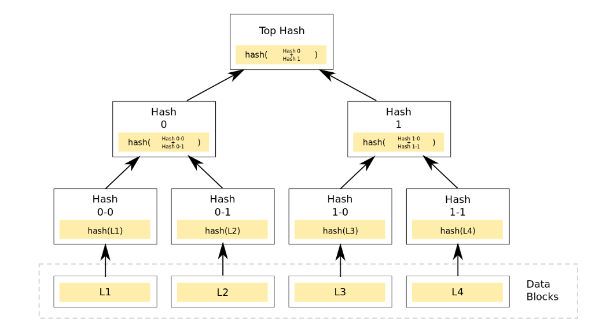
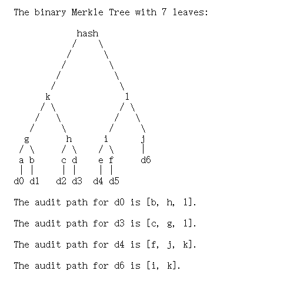
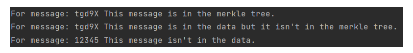

##### Project：Impl Merkle Tree following RFC6962

对于MerkleTree的实现较为简单，根据下图所示结构，在实现时自底向上实现即可，注意块数为奇数时需要特殊处理。

对于MerkleTree proof的实现参考了RFC6962，对于每个data都找到一条与之对应的audit path用于检验该数据是否属于该数，RFC6962中举了如下例子：

直接运行MerkleTree.py文件即可

代码会进行如下三步：

1.创建一棵MerkleTree，称之为MkT1，并随机从其Data中挑选一个块检验其是否在MkT1中。

2.创建一棵MerkleTree，称之为MkT2，且保证其Data中有一个块与MkT1的Data中有一个块相同，并检验该块是否在MkT1中。

3.检验一个已知的数据块(大概率不在MkT1的Data中)是否在MkT1的Data中。

