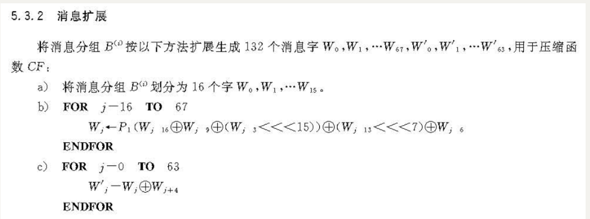
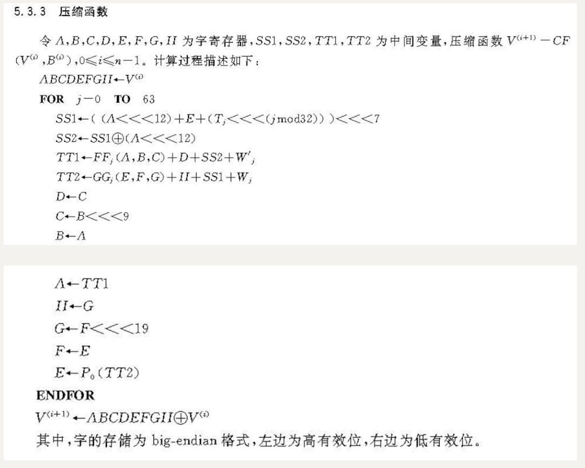

使用rust编写的SM3实现,利用了rust方便的包管理与错误处理以及测试功能

执行`cargo test`即可运行所以测试

项目分为compress和lib两个crate

```rust
fn compress_u32(state: &mut [u32; 8], block: &[u32; 16]) {
    let mut x: [u32; 16] = *block;

    let mut a = state[0];
    let mut b = state[1];
    let mut c = state[2];
    let mut d = state[3];
    let mut e = state[4];
    let mut f = state[5];
    let mut g = state[6];
    let mut h = state[7];

    R1!(a, b, c, d, e, f, g, h, t(0), w1(&x, 0), w1(&x, 4));
    R1!(d, a, b, c, h, e, f, g, t(1), w1(&x, 1), w1(&x, 5));
    R1!(c, d, a, b, g, h, e, f, t(2), w1(&x, 2), w1(&x, 6));
    R1!(b, c, d, a, f, g, h, e, t(3), w1(&x, 3), w1(&x, 7));
    R1!(a, b, c, d, e, f, g, h, t(4), w1(&x, 4), w1(&x, 8));
    R1!(d, a, b, c, h, e, f, g, t(5), w1(&x, 5), w1(&x, 9));
    R1!(c, d, a, b, g, h, e, f, t(6), w1(&x, 6), w1(&x, 10));
    R1!(b, c, d, a, f, g, h, e, t(7), w1(&x, 7), w1(&x, 11));
    R1!(a, b, c, d, e, f, g, h, t(8), w1(&x, 8), w1(&x, 12));
    R1!(d, a, b, c, h, e, f, g, t(9), w1(&x, 9), w1(&x, 13));
    R1!(c, d, a, b, g, h, e, f, t(10), w1(&x, 10), w1(&x, 14));
    R1!(b, c, d, a, f, g, h, e, t(11), w1(&x, 11), w1(&x, 15));
    R1!(a, b, c, d, e, f, g, h, t(12), w1(&x, 12), w2(&mut x, 16));
    R1!(d, a, b, c, h, e, f, g, t(13), w1(&x, 13), w2(&mut x, 17));
    R1!(c, d, a, b, g, h, e, f, t(14), w1(&x, 14), w2(&mut x, 18));
    R1!(b, c, d, a, f, g, h, e, t(15), w1(&x, 15), w2(&mut x, 19));
    R2!(a, b, c, d, e, f, g, h, t(16), w1(&x, 16), w2(&mut x, 20));
    R2!(d, a, b, c, h, e, f, g, t(17), w1(&x, 17), w2(&mut x, 21));
    R2!(c, d, a, b, g, h, e, f, t(18), w1(&x, 18), w2(&mut x, 22));
    R2!(b, c, d, a, f, g, h, e, t(19), w1(&x, 19), w2(&mut x, 23));
    R2!(a, b, c, d, e, f, g, h, t(20), w1(&x, 20), w2(&mut x, 24));
    R2!(d, a, b, c, h, e, f, g, t(21), w1(&x, 21), w2(&mut x, 25));
    R2!(c, d, a, b, g, h, e, f, t(22), w1(&x, 22), w2(&mut x, 26));
    R2!(b, c, d, a, f, g, h, e, t(23), w1(&x, 23), w2(&mut x, 27));
    R2!(a, b, c, d, e, f, g, h, t(24), w1(&x, 24), w2(&mut x, 28));
    R2!(d, a, b, c, h, e, f, g, t(25), w1(&x, 25), w2(&mut x, 29));
    R2!(c, d, a, b, g, h, e, f, t(26), w1(&x, 26), w2(&mut x, 30));
    R2!(b, c, d, a, f, g, h, e, t(27), w1(&x, 27), w2(&mut x, 31));
    R2!(a, b, c, d, e, f, g, h, t(28), w1(&x, 28), w2(&mut x, 32));
    R2!(d, a, b, c, h, e, f, g, t(29), w1(&x, 29), w2(&mut x, 33));
    R2!(c, d, a, b, g, h, e, f, t(30), w1(&x, 30), w2(&mut x, 34));
    R2!(b, c, d, a, f, g, h, e, t(31), w1(&x, 31), w2(&mut x, 35));
    R2!(a, b, c, d, e, f, g, h, t(32), w1(&x, 32), w2(&mut x, 36));
    R2!(d, a, b, c, h, e, f, g, t(33), w1(&x, 33), w2(&mut x, 37));
    R2!(c, d, a, b, g, h, e, f, t(34), w1(&x, 34), w2(&mut x, 38));
    R2!(b, c, d, a, f, g, h, e, t(35), w1(&x, 35), w2(&mut x, 39));
    R2!(a, b, c, d, e, f, g, h, t(36), w1(&x, 36), w2(&mut x, 40));
    R2!(d, a, b, c, h, e, f, g, t(37), w1(&x, 37), w2(&mut x, 41));
    R2!(c, d, a, b, g, h, e, f, t(38), w1(&x, 38), w2(&mut x, 42));
    R2!(b, c, d, a, f, g, h, e, t(39), w1(&x, 39), w2(&mut x, 43));
    R2!(a, b, c, d, e, f, g, h, t(40), w1(&x, 40), w2(&mut x, 44));
    R2!(d, a, b, c, h, e, f, g, t(41), w1(&x, 41), w2(&mut x, 45));
    R2!(c, d, a, b, g, h, e, f, t(42), w1(&x, 42), w2(&mut x, 46));
    R2!(b, c, d, a, f, g, h, e, t(43), w1(&x, 43), w2(&mut x, 47));
    R2!(a, b, c, d, e, f, g, h, t(44), w1(&x, 44), w2(&mut x, 48));
    R2!(d, a, b, c, h, e, f, g, t(45), w1(&x, 45), w2(&mut x, 49));
    R2!(c, d, a, b, g, h, e, f, t(46), w1(&x, 46), w2(&mut x, 50));
    R2!(b, c, d, a, f, g, h, e, t(47), w1(&x, 47), w2(&mut x, 51));
    R2!(a, b, c, d, e, f, g, h, t(48), w1(&x, 48), w2(&mut x, 52));
    R2!(d, a, b, c, h, e, f, g, t(49), w1(&x, 49), w2(&mut x, 53));
    R2!(c, d, a, b, g, h, e, f, t(50), w1(&x, 50), w2(&mut x, 54));
    R2!(b, c, d, a, f, g, h, e, t(51), w1(&x, 51), w2(&mut x, 55));
    R2!(a, b, c, d, e, f, g, h, t(52), w1(&x, 52), w2(&mut x, 56));
    R2!(d, a, b, c, h, e, f, g, t(53), w1(&x, 53), w2(&mut x, 57));
    R2!(c, d, a, b, g, h, e, f, t(54), w1(&x, 54), w2(&mut x, 58));
    R2!(b, c, d, a, f, g, h, e, t(55), w1(&x, 55), w2(&mut x, 59));
    R2!(a, b, c, d, e, f, g, h, t(56), w1(&x, 56), w2(&mut x, 60));
    R2!(d, a, b, c, h, e, f, g, t(57), w1(&x, 57), w2(&mut x, 61));
    R2!(c, d, a, b, g, h, e, f, t(58), w1(&x, 58), w2(&mut x, 62));
    R2!(b, c, d, a, f, g, h, e, t(59), w1(&x, 59), w2(&mut x, 63));
    R2!(a, b, c, d, e, f, g, h, t(60), w1(&x, 60), w2(&mut x, 64));
    R2!(d, a, b, c, h, e, f, g, t(61), w1(&x, 61), w2(&mut x, 65));
    R2!(c, d, a, b, g, h, e, f, t(62), w1(&x, 62), w2(&mut x, 66));
    R2!(b, c, d, a, f, g, h, e, t(63), w1(&x, 63), w2(&mut x, 67));

    state[0] ^= a;
    state[1] ^= b;
    state[2] ^= c;
    state[3] ^= d;
    state[4] ^= e;
    state[5] ^= f;
    state[6] ^= g;
    state[7] ^= h;
}

pub(crate) fn compress(state: &mut [u32; 8], blocks: &[Block<Sm3Core>]) {
    for block in blocks {
        let mut w = [0u32; 16];
        for (o, chunk) in w.iter_mut().zip(block.chunks_exact(4)) {
            *o = u32::from_be_bytes(chunk.try_into().unwrap());
        }
        compress_u32(state, &w);
    }
}

```


## SM3的组成部件

### 布尔函数


### 置换函数


### 消息扩展



```rust
#![allow(clippy::many_single_char_names, clippy::too_many_arguments)]
use crate::{consts::T32, Block, Sm3Core};
use core::convert::TryInto;

#[inline(always)]
fn ff1(x: u32, y: u32, z: u32) -> u32 {
    x ^ y ^ z
}

#[inline(always)]
fn ff2(x: u32, y: u32, z: u32) -> u32 {
    (x & y) | (x & z) | (y & z)
}

#[inline(always)]
fn gg1(x: u32, y: u32, z: u32) -> u32 {
    x ^ y ^ z
}

#[inline(always)]
fn gg2(x: u32, y: u32, z: u32) -> u32 {
    // This line is equivalent to `(x & y) | (!x & z)`, but executes faster
    (y ^ z) & x ^ z
}

#[inline(always)]
fn p0(x: u32) -> u32 {
    x ^ x.rotate_left(9) ^ x.rotate_left(17)
}

#[inline(always)]
fn p1(x: u32) -> u32 {
    x ^ x.rotate_left(15) ^ x.rotate_left(23)
}

#[inline(always)]
fn w1(x: &[u32; 16], i: usize) -> u32 {
    x[i & 0x0f]
}

#[inline(always)]
fn w2(x: &mut [u32; 16], i: usize) -> u32 {
    let tw = w1(x, i) ^ w1(x, i - 9) ^ w1(x, i - 3).rotate_left(15);
    let tw = p1(tw) ^ w1(x, i - 13).rotate_left(7) ^ w1(x, i - 6);
    x[i & 0x0f] = tw;
    tw
}

#[inline(always)]
fn t(i: usize) -> u32 {
    T32[i]
}

fn sm3_round1(
    a: u32,
    b: u32,
    c: u32,
    d: u32,
    e: u32,
    f: u32,
    g: u32,
    h: u32,
    t: u32,
    w1: u32,
    w2: u32,
) -> [u32; 8] {
    let ss1 = (a.rotate_left(12).wrapping_add(e).wrapping_add(t)).rotate_left(7);
    let ss2 = ss1 ^ a.rotate_left(12);

    let d = d
        .wrapping_add(ff1(a, b, c))
        .wrapping_add(ss2)
        .wrapping_add(w1 ^ w2);
    let h = h
        .wrapping_add(gg1(e, f, g))
        .wrapping_add(ss1)
        .wrapping_add(w1);
    let b = b.rotate_left(9);
    let f = f.rotate_left(19);
    let h = p0(h);

    [a, b, c, d, e, f, g, h]
}

fn sm3_round2(
    a: u32,
    b: u32,
    c: u32,
    d: u32,
    e: u32,
    f: u32,
    g: u32,
    h: u32,
    t: u32,
    w1: u32,
    w2: u32,
) -> [u32; 8] {
    let ss1 = (a.rotate_left(12).wrapping_add(e).wrapping_add(t)).rotate_left(7);
    let ss2 = ss1 ^ a.rotate_left(12);

    let d = d
        .wrapping_add(ff2(a, b, c))
        .wrapping_add(ss2)
        .wrapping_add(w1 ^ w2);
    let h = h
        .wrapping_add(gg2(e, f, g))
        .wrapping_add(ss1)
        .wrapping_add(w1);
    let b = b.rotate_left(9);
    let f = f.rotate_left(19);
    let h = p0(h);

    [a, b, c, d, e, f, g, h]
}
```


### 压缩函数



运行测试通过且速度非常快


