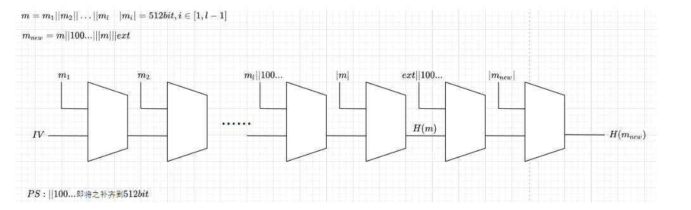
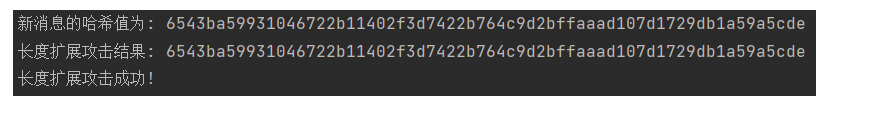

##### Project：implement length extension attack for SM3

该项目使用Python实现

对SM3进行长度扩展攻击，设已知消息$m$，其哈希值为$H(m)$，扩展部分为$ext$，则对其进行长度扩展攻击的原理如下图所示：

按照该图进行代码实现即可实现对SM3的长度扩展攻击

len_exten_atk.py与sm3.py放到同一级目录下，直接运行

代码会自动计算出添加扩展内容后的新消息，并计算出其哈希值与长度扩展攻击得到的结果进行对比，以验证长度扩展攻击是否成功。

